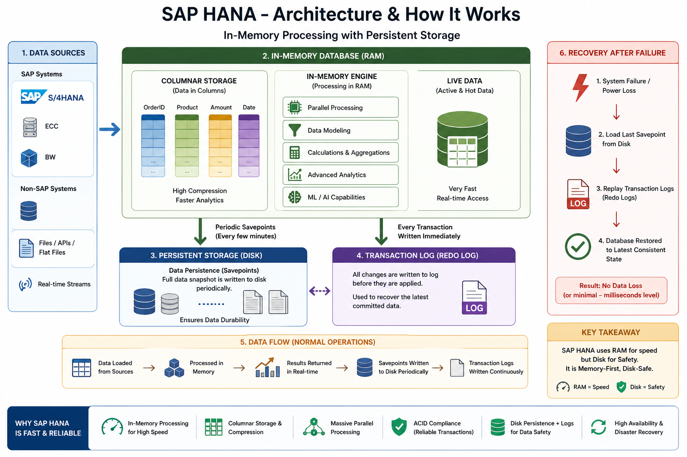

# HANA DB

#### LINKS

- https://www.guru99.com/sap-hana-tutorial.html
- https://www.tutorialspoint.com/sap_hana/index.htm

---

<aside>

**SAP HANA** is the latest, in-memory database, and platform which can be deployed on-premises or cloud. SAP HANA is a combination of hardware and software, which integrates different components like SAP HANA Database, SAP SLT (System Landscape Transformation) Replication server, SAP HANA Direct Extractor connection, and Sybase replication.

</aside>

#### HANA = High-Performance Analytic Appliance

- **High-Performance** → Very fast processing
- **Analytic** → Designed for real-time data analysis
- **Appliance** → Combination of software + optimized hardware

---

#### CHARACTERISTICS OF HANA DB

- SAP HANA Database is Main-Memory centric data management platform.
- SAP HANA Database runs on SUSE enterprise-grade Linux operating system and builds on C++ Language.
    - **SUSE = Software und System-Entwicklung** *(German)*
    - **English Meaning:** *Software and Systems Development*
- SAP HANA Database can be distributed to multiple machines.
- SAP HANA is useful as it’s very fast due to all data loaded in-Memory and no need to load data from disk.
- SAP HANA can be used for the purpose of OLAP (On-line analytic) and OLTP (On-Line Transaction) on a single database.
- Used extensively in Memory Computing Engine (IMCE) to process and analyze massive amount of real time data.

---

### **SAP HANA Vendors**

SAP has partnered with leading IT hardware vendors like IBM, Dell, Cisco etc. and combined it with SAP licensed services and technology to sell SAP HANA platform.

There are, total, 11 vendors that manufacture HANA Appliances and provide onsite support for installation and configuration of HANA system.

**Top few Vendors include** −

- IBM
- Dell
- HP
- Cisco
- Fujitsu
- Lenovo (China)
- NEC
- Huawei

According to statistics provided by SAP, IBM is one of major vendor of SAP HANA hardware appliances and has a market share of 50-52% but according to another market survey conducted by HANA clients, IBM has a market hold up to 70%.

---

### **SAP HANA - In-Memory Computing Engine**

An In-Memory database means all the data from source system is stored in a RAM memory. In a conventional Database system, all data is stored in hard disk. SAP HANA In-Memory Database wastes no time in loading the data from hard disk to RAM. It provides faster access of data to multicore CPUs for information processing and analysis.

The main features of SAP HANA in-memory database are −

- SAP HANA is Hybrid In-memory database.
- It combines row based, column based and Object Oriented base technology.
- It uses parallel processing with multicore CPU Architecture.
- Conventional Database reads memory data in 5 milliseconds. SAP HANA In-Memory database reads data in 5 nanoseconds.
- It means, memory reads in HANA database are 1 million times faster than a conventional database hard disk memory reads.
- Analysts want to see current data immediately in real time and do not want to wait for data until it is loaded to SAP BW system.
    - SAP BW is a data warehousing system that collects, stores, and analyzes data from different sources to support reporting and decision-making.
    - SAP BW acts as a **central data hub**
- SAP HANA In-Memory processing allows loading of real time data with use of various data provisioning techniques.

---

#### I have a doubt SAP HANA DB is entirely made up of RAM, how does it entirely does that, without a secondary memory how can it survive? are is there any special hardware used?

If SAP HANA used **only RAM with no persistence**, it would be a disaster (one power cut = total data loss). That’s **not how it actually works**.



### 🧠 First Truth (Important)

 **SAP HANA database is NOT “RAM-only.”**

 It is **memory-first, but disk-safe**.
 

#### ⚙️ How SAP HANA Actually Works

#### 🧩 1. RAM = Primary Working Area

- All active data is stored in **RAM**
- This is why HANA is extremely fast

👉 Think:

- RAM = “live working memory”

#### 💾 2. Disk = Permanent Storage

HANA **always uses disk storage** for persistence.

Two key mechanisms:

#### 📜 a) Data Persistence (Savepoints)

- Every few minutes, HANA writes full data from RAM → disk
- Called **savepoints**

👉 Ensures:

- Data is safely stored on disk

#### 🧾 b) Transaction Log (Redo Log)

- Every change is written immediately to disk logs

👉 Even before savepoint:

- Changes are already safe

#### 🔄 What Happens If Power Fails?

1. System restarts
2. Loads last **savepoint from disk**
3. Replays **redo logs**
4. Restores full data

👉 Result: **No data loss (or minimal, milliseconds level)**

---

### 🏗️ So What is Special About HANA?

#### 🚀 1. Columnar Storage

- Data stored column-wise (not row-wise)
- Faster analytics

#### ⚡ 2. Compression

- Data in RAM is compressed
- Reduces memory usage

👉 Example:

- 1 TB data → may fit in ~200–300 GB RAM

#### 🧠 3. Hybrid Engine

- Combines:
    - OLTP (transactions)
    - OLAP (analytics)

---

#### 🖥️ Is Special Hardware Required?

👉 YES (optimized, but not “magic”)

#### 🔧 Typical HANA Hardware:

- Large RAM (hundreds of GB to TBs)
- SSD storage (very fast disks)
- Multi-core CPUs
- High-speed network

---

#### 🏢 Certified Systems

SAP provides **certified hardware appliances** from vendors like:

- Dell
- Hewlett Packard Enterprise
- Lenovo

👉 These are optimized for HANA workloads

---

#### 🧠 Simple Analogy (Best Way to Remember)

Think of HANA like:

- RAM = **Workspace (desk)**
- Disk = **Locker (safe storage)**
- Logs = **CCTV recording every action**

👉 Even if desk is wiped, locker + CCTV restores everything

---

#### ⚠️ Common Misconception

❌ “HANA doesn’t use disk”

✔ “HANA minimizes disk usage for speed, but still depends on it for safety”

#### One-Line Answer

> “SAP HANA is an in-memory database that uses RAM for fast processing but ensures durability through disk-based persistence using savepoints and transaction logs, allowing full recovery even after system failures.”
> 

---

#### Compression Logic

First, a small correction to keep things accurate:

👉 HANA doesn’t *compress data “from disk into RAM” on the fly*.

👉 Instead, **data is stored in a compressed format *inside RAM itself*** (and also persisted compressed on disk).

---

#### 🧠 First Principle

> Data is **compressed BEFORE and WHILE it is stored in RAM**—not just when coming from disk.
> 

👉 So HANA doesn’t:

- Load 1 TB into RAM → then compress ❌
- Loads data → **stores it already compressed in memory** ✔️

---

### 🔄 Flow: Disk → RAM (How Compression Happens)

#### 📥 Step 1: Data Read from Disk

- Data is read from disk (persistent storage)
- Typically stored in a **row-based format**

#### 🔄 Step 2: Transformation to Column Format

- HANA converts data into **columnar storage**

Instead of storing rows like this:

| ID | Name | City |
| --- | --- | --- |
| 1 | A | Chennai |
| 2 | B | Madurai |

HANA stores **columns separately**:

| ID | Name | City |
| --- | --- | --- |
| 1,2 | A,B | Chennai, Madurai |

👉 Same values grouped together = **high compression potential**

---

### Main Compression Techniques Used

#### 1. 📚 Dictionary Encoding (Most Important)

Instead of storing full values repeatedly:

#### Without compression:

```
Chennai, Chennai, Chennai, Mumbai
```

#### With dictionary encoding:

```
Dictionary:
1 → Chennai
2 → Mumbai

Data:
1, 1, 1, 2
```

👉 Huge memory saving

👉 Works extremely well for repeated values

---

### 2. 🔢 Run-Length Encoding (RLE)

Best when values repeat continuously.

#### Example:

```
1, 1, 1, 1, 2, 2
```

Stored as:

```
(1 × 4), (2 × 2)
```

👉 Saves space + speeds up scans

---

### 3. 🧮 Bit Packing

If values are small numbers:

Instead of:

- Using 32 bits per value

👉 Use only required bits:

- e.g., 3 bits if values are 1–5

---

### 4. 📉 Delta Encoding

Store differences instead of full values:

Instead of:

- [100, 101, 102]

👉 Store:

- [100, +1, +1]

---

### Why HANA Can Process Compressed Data Directly

This is the killer advantage:

👉 Traditional DB:

- Decompress → Process → Slow

👉 HANA:

- **Process directly on compressed data**

Example:

- Counting “Chennai”
- Instead of scanning full strings → just count dictionary key “1”

💡 This is why:

- Compression = **faster**, not slower

---

## Data Flow (Disk ↔ RAM)

#### 📥 When data is loaded:

1. Data comes from disk
2. Converted into column format
3. Compressed (dictionary, RLE, etc.)
4. Stored in RAM (compressed)

#### 💾 When writing back to disk:

- Data is already compressed
- Written as compressed savepoints

👉 No extra overhead

#### 📊 Real Impact

> 1 TB data → ~200–300 GB RAM
> 

Because:

- Repeated values compressed
- Column storage eliminates redundancy
- Efficient encoding reduces size

👉 Compression ratio:

- 3x to 10x (sometimes even more)

#### ⚠️ Important Clarification

❌ RAM is not storing “raw full data”

✔ RAM stores **optimized, compressed, structured data**

---

### 🧠 Simple Analogy

Think of it like:

- Normal DB → stores full sentences repeatedly
- HANA → stores:
    - Vocabulary (dictionary)
    - References (codes)

👉 Much smaller + faster to search

### 🎯 One-Line Interview Answer

> “SAP HANA uses columnar storage with techniques like dictionary encoding and run-length encoding to store data in compressed form directly in memory, allowing it to process data without full decompression, which improves both performance and memory efficiency.”
> 

#### ROW VS COLUMN DB

<center>  </center>

---