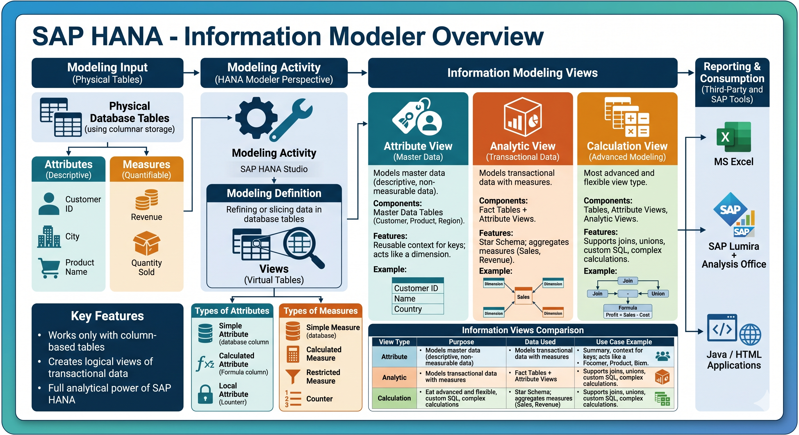

### Pull it and view in Code Editor for better View

# SAP HANA - Information Modeler

SAP HANA Information Modeler, also known as **HANA Data Modeler**, is the heart of the HANA system. It enables the creation of modeling views on top of database tables and allows implementation of business logic to generate meaningful reports for analysis.

## VIEWS

A **view** in databases (and specifically in SAP HANA) is essentially a **virtual table** created by querying existing tables. It does not store data itself but provides a structured way to look at and work with data.

- A **view** is a saved SQL query that presents data from one or more tables.
- It behaves like a table when queried, but the data is generated dynamically from the underlying tables.
- Views simplify complex queries, enforce security (by exposing only certain columns/rows), and provide consistency in reporting.

## Modeling in SAP HANA

- **Definition:** Modeling is the activity of refining or slicing data in database tables by creating *views* that depict a business scenario.
- **Purpose:** These views allow businesses to analyze, report, and make decisions based on structured data.

### Types of Data

- **Attributes:** Descriptive data *(e.g., Customer ID, City, Product Name)*
- **Measures:** Quantifiable data *(e.g., Revenue, Quantity Sold)*

#### Tools

SAP HANA Studio (Modeler Perspective) provides graphical modeling tools to design, edit, and manage these views.

## What is SAP HANA Modeling?

SAP HANA Modeling is an activity in which we create **Information Views**. Information Views are similar to dimensions, cubes, or information providers in BW. These information views are used for creating a multi-dimensional data model.

## SAP HANA Modeling Overview

Modeling is an activity in which users refine or slice data in database tables by creating information views based on business scenarios. These information views can then be used for reporting and decision-making purposes.

> Information Views are created from various combinations of content data to build a model for a business scenario.

## Types of Attributes

SAP HANA supports three types of attributes:

| Types of Attributes | Activities |
|---|---|
| **Simple Attribute** | Derived directly from the data foundation. |
| **Calculated Attribute** | Derived from one or more existing attributes and constants. Example: arithmetic calculations or deriving full name from first and last name. |
| **Local Attribute** | Used inside modeling views (Analytic View / Calculation View) to customize attribute behavior. Accessible only within that modeling view. |

## Types of Measures

SAP HANA supports four types of measures:

| Types of Measures | Activities |
|---|---|
| **Simple Measure** | Derived directly from the data foundation. |
| **Calculated Measure** | Derived from one or more existing measures, constants, and functions. Example: arithmetic calculations. |
| **Restricted Measure** | Used to filter values based on user-defined rules for attribute values. |
| **Counter** | Special column type that displays unique numbers for attribute columns. Used for counting one or more attribute columns. |

## Features of Information Modeler

- Provides multiple views of transactional data stored in physical HANA database tables for analysis and business logic purposes.
- Information Modeler works only with **column-based storage tables**.
- Information Modeling Views can be consumed by Java or HTML-based applications or SAP tools like SAP Lumira or Analysis Office for reporting.
- Third-party tools such as MS Excel can also connect to HANA for reporting.
- SAP HANA Modeling Views utilize the full analytical power of SAP HANA.

## Information Modeling Views

### Three Types of Information Views

- **Attribute View**
- **Analytic View**
- **Calculation View**

#### Information Views Classification

- **Attribute View** → Used for master data context.
- **Analytic View** → Used for creating fact tables and similar to BW cubes.
- **Calculation View** → Used for creating complex views and similar to multiple providers in BW [Business Warehouse].

SAP HANA extends the concept of views with **Information Views**, specifically designed for analytics and modeling.

### 1. Attribute View

- Represents master data.
- Contains descriptive attributes like Customer, Product, and Region.
- Does not contain measures.

### 2. Analytic View

- Represents transactional data with measures such as Sales and Revenue.
- Combines fact tables with Attribute Views.

### 3. Calculation View

- Most advanced and flexible view type.
- Supports joins, unions, custom SQL, and complex calculations.
- Replaces Attribute and Analytic Views in modern HANA versions.

## Comparison of Information Views

| View Type | Purpose | Data Used | Key Features | Use Case Example |
|---|---|---|---|---|
| **Attribute View** | Models master data (descriptive, non-measurable data). | Master data tables such as customer, product, and geography. | Provides descriptions for keys, reusable across models, and acts like a dimension. | Reusable customer attribute view containing ID, name, and country. |
| **Analytic View** | Models transactional data with measures. | Fact tables + Attribute Views. | Contains measures like sales and revenue, supports aggregations, and uses star schema design. | Sales revenue analysis using customer and product dimensions. |
| **Calculation View** | Advanced modeling with complex logic. | Combination of tables, Attribute Views, and Analytic Views. | Supports unions, joins, custom SQL, and complex calculations. | Profit calculation using sales and cost tables with custom formulas. |

### Summary 

  

---

