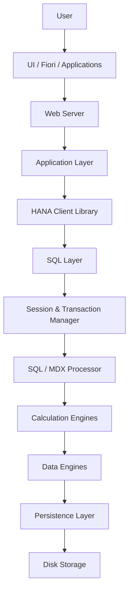

# 🚀 SAP HANA Architecture & Virtual Layers
# 📚 Table of Contents

- [🚀 SAP HANA Architecture \& Virtual Layers](#-sap-hana-architecture--virtual-layers)
- [📚 Table of Contents](#-table-of-contents)
    - [🌐 Introduction](#-introduction)
    - [🏗️ SAP HANA Virtual Layers](#️-sap-hana-virtual-layers)
    - [📌 SAP HANA Layer Overview](#-sap-hana-layer-overview)
    - [🧭 Layered Architecture Diagram](#-layered-architecture-diagram)
    - [🔑 Acronym to Remember](#-acronym-to-remember)
    - [🎬 Mnemonic](#-mnemonic)
    - [👨‍💻 Consultant Responsibility Matrix](#-consultant-responsibility-matrix)
    - [📊 Consultant vs HANA Layer Mapping](#-consultant-vs-hana-layer-mapping)
    - [📌 Understanding the Roles](#-understanding-the-roles)
    - [🛠️ Basis Consultant](#️-basis-consultant)
    - [🔐 GRC Consultant](#-grc-consultant)
    - [💻 ABAP Consultant](#-abap-consultant)
    - [🖼️ SAP HANA Runtime Architecture](#️-sap-hana-runtime-architecture)
    - [🔄 End-to-End Request Flow](#-end-to-end-request-flow)
    - [🧩 Detailed Component Breakdown](#-detailed-component-breakdown)
    - [1️⃣ UI Layer](#1️⃣-ui-layer)
    - [📌 Examples](#-examples)
    - [2️⃣ HTTP / HTML Layer](#2️⃣-http--html-layer)
    - [🌐 Protocols Used](#-protocols-used)
  - [| HTML     | Web content rendering      |](#-html------web-content-rendering------)
    - [3️⃣ Web Server](#3️⃣-web-server)
    - [📌 Responsibilities](#-responsibilities)
    - [🛠️ Examples](#️-examples)
    - [4️⃣ Application Layer](#4️⃣-application-layer)
    - [📌 Responsibilities](#-responsibilities-1)
    - [🛠️ Technologies](#️-technologies)
  - [| OData      | API services            |](#-odata-------api-services------------)
    - [5️⃣ HANA Client Library](#5️⃣-hana-client-library)
    - [🔌 Examples](#-examples-1)
    - [📌 Responsibilities](#-responsibilities-2)
    - [6️⃣ SQL Layer](#6️⃣-sql-layer)
    - [🧪 Example Query](#-example-query)
    - [7️⃣ Session \& Transaction Manager](#7️⃣-session--transaction-manager)
    - [👤 Session Management](#-session-management)
    - [🔄 Transaction Management](#-transaction-management)
    - [⚠️ Important Concept](#️-important-concept)
    - [8️⃣ SQL / MDX Processor](#8️⃣-sql--mdx-processor)
    - [📚 Supported Languages](#-supported-languages)
    - [✅ Parse Query](#-parse-query)
    - [✅ Validate Query](#-validate-query)
    - [✅ Optimize Query](#-optimize-query)
    - [9️⃣ Processing Engines](#9️⃣-processing-engines)
    - [⚙️ Main Engines](#️-main-engines)
    - [📌 Responsibilities](#-responsibilities-3)
    - [🔟 Data Engines](#-data-engines)
    - [📦 Available Data Engines](#-available-data-engines)
    - [❓ Why Multiple Engines?](#-why-multiple-engines)
    - [1️⃣1️⃣ Repository](#1️⃣1️⃣-repository)
    - [📦 Contains](#-contains)
    - [🧠 Think of it as](#-think-of-it-as)
    - [1️⃣2️⃣ Persistence Layer](#1️⃣2️⃣-persistence-layer)
    - [📌 Responsibilities](#-responsibilities-4)
    - [💾 Savepoints](#-savepoints)
    - [📝 Transaction Logs](#-transaction-logs)
    - [1️⃣3️⃣ Index Server](#1️⃣3️⃣-index-server)
    - [📌 Contains](#-contains-1)
    - [⚠️ Important Concept](#️-important-concept-1)
    - [1️⃣4️⃣ Preprocessor Server](#1️⃣4️⃣-preprocessor-server)
    - [📌 Used For](#-used-for)
    - [1️⃣5️⃣ Name Server](#1️⃣5️⃣-name-server)
    - [📌 Responsibilities](#-responsibilities-5)
    - [⚠️ Important Concept](#️-important-concept-2)
    - [📊 Architecture Summary Table](#-architecture-summary-table)
    - [🛠️ Complete Runtime Flow](#️-complete-runtime-flow)
    - [🎯 Final Summary](#-final-summary)
    - [⭐ Key Takeaway](#-key-takeaway)
    - [Images for AI Copilot's](#images-for-ai-copilots)
      - [CHATGPT'S HANA ARCHITECTURE DIAGRAM](#chatgpts-hana-architecture-diagram)
      - [CLAUDE'S HANA LAYER DIAGRAM](#claudes-hana-layer-diagram)
      - [CLAUDE'S COMPONENTS DIAGRAM](#claudes-components-diagram)
<hr style="height: 3px; background-color: #333; border: none;">

### 🌐 Introduction
SAP HANA is an **in-memory relational database platform** developed by SAP that combines:

* High-speed transactional processing (OLTP)
* Advanced analytical processing (OLAP)
* Real-time analytics
* Application services
* Data processing engines

Unlike traditional databases, SAP HANA performs most operations directly in memory, enabling extremely fast data access and real-time processing.
<hr style="height: 3px; background-color: #333; border: none;">

### 🏗️ SAP HANA Virtual Layers
SAP HANA architecture can be logically divided into multiple layers.

These layers help separate responsibilities such as:

* Application communication
* Database processing
* Data persistence
* Security
* Infrastructure management

<hr style="height: 3px; background-color: #333; border: none;">

### 📌 SAP HANA Layer Overview

| # | Layer                              | Main Purpose                                                    |
| - | ---------------------------------- | --------------------------------------------------------------- |
| 1 | **Client / Application Layer**     | Allows users and applications to interact with SAP HANA         |
| 2 | **XS Engine Layer**                | Hosts web apps, APIs, and services inside HANA                  |
| 3 | **Database & Processing Layer**    | Executes queries, calculations, analytics, and transactions     |
| 4 | **Persistence Layer**              | Ensures durability and crash recovery                           |
| 5 | **Data Provisioning Layer**        | Loads and integrates data from external systems                 |
| 6 | **Infrastructure Layer**           | Provides hardware, OS, memory, storage, and networking          |
| 7 | **Deployment & Multitenant Layer** | Handles scaling and tenant isolation                            |
| 8 | **Security Layer**                 | Handles authentication, authorization, encryption, and auditing |

<hr style="height: 3px; background-color: #333; border: none;">

### 🧭 Layered Architecture Diagram
```mermaid
A[Client / Application Layer]
B[XS Engine Layer]
C[Database & Processing Layer]
D[Persistence Layer]
E[Data Provisioning Layer]
F[Infrastructure Layer]
G[Deployment & Multitenant Layer]
H[Security Layer]

A --> B
B --> C
C --> D
D --> F
E --> C
G --> C
H --> A
H --> B
H --> C
```
<hr style="height: 3px; background-color: #333; border: none;">

### 🔑 Acronym to Remember
```text
CX/DPD/IDS
```
### 🎬 Mnemonic
> “Captain X and Defenders Punched Dormammu In Doom’s Sanctum.”
<hr style="height: 3px; background-color: #333; border: none;">

### 👨‍💻 Consultant Responsibility Matrix
Different SAP consultants interact with different HANA layers depending on their specialization.
### 📊 Consultant vs HANA Layer Mapping

| SAP HANA Layer                 | Basis Consultant | GRC Consultant | ABAP Consultant |
| ------------------------------ | ---------------- | -------------- | --------------- |
| Client/Application Layer       | ⚪ Partial        | ⚪ Partial      | ✅ Major         |
| XS Engine Layer                | ⚪ Partial        | ❌ Rare         | ✅ Major         |
| Database & Processing Layer    | ✅ Major          | ⚪ Partial      | ✅ Major         |
| Persistence Layer              | ✅ Major          | ❌ Rare         | ❌ Rare          |
| Data Provisioning Layer        | ✅ Major          | ⚪ Partial      | ⚪ Partial       |
| Infrastructure Layer           | ✅ Major          | ❌ Rare         | ❌ Rare          |
| Deployment & Multitenant Layer | ✅ Major          | ❌ Rare         | ❌ Rare          |
| Security Layer                 | ⚪ Partial        | ✅ Major        | ⚪ Partial       |
### 📌 Understanding the Roles
### 🛠️ Basis Consultant

Primarily responsible for:

* System administration
* Performance tuning
* Infrastructure
* Database operations
* Multitenancy
* Backups and recovery

---

### 🔐 GRC Consultant

Primarily responsible for:

* Authorization concepts
* Compliance
* Risk management
* Security governance
* Segregation of duties (SoD)

---

### 💻 ABAP Consultant

Primarily responsible for:

* Business logic
* SQL optimization
* CDS views
* HANA procedures
* Application development
<hr style="height: 3px; background-color: #333; border: none;">

### 🖼️ SAP HANA Runtime Architecture

SAP HANA request processing flow can be simplified as:

```text
User Request → Application → HANA Processing → Data Engines → Persistence
```
### 🔄 End-to-End Request Flow


<hr style="height: 3px; background-color: #333; border: none;">

### 🧩 Detailed Component Breakdown
<center> 
   
</center>

### 1️⃣ UI Layer

This is the front-end interaction layer
### 📌 Examples
* SAP Fiori
* SAP GUI
* Analytics Dashboards
* Web Applications
* Third-party Applications
---
### 2️⃣ HTTP / HTML Layer
This layer manages communication protocols.
### 🌐 Protocols Used
| Protocol | Purpose                    |
| -------- | -------------------------- |
| HTTP     | Standard web communication |
| HTTPS    | Secure communication       |
| REST     | API communication          |
| OData    | SAP service communication  |
| HTML     | Web content rendering      |
---
### 3️⃣ Web Server
The request first reaches the web/application server.
### 📌 Responsibilities

* Accept client requests
* Manage sessions
* Route traffic
* Handle web communication
---
### 🛠️ Examples
* SAP NetWeaver
* XS Engine
* Apache
* Tomcat
---
### 4️⃣ Application Layer
This layer contains the business logic.
### 📌 Responsibilities
* Validate inputs
* Apply business rules
* Generate SQL queries
* Process APIs
### 🛠️ Technologies

| Technology | Purpose                 |
| ---------- | ----------------------- |
| ABAP       | SAP business logic      |
| Java       | Enterprise applications |
| Node.js    | Backend services        |
| OData      | API services            |
---
### 5️⃣ HANA Client Library
Acts as the connector between applications and SAP HANA.
### 🔌 Examples
* JDBC
* ODBC
* Python HANA Client
* Node.js HANA Driver
### 📌 Responsibilities
* Convert application requests
* Establish database communication
* Transfer SQL commands
---
### 6️⃣ SQL Layer
The SQL layer receives SQL commands from applications.
### 🧪 Example Query

```sql
SELECT SUM(SALES)
FROM ORDERS;
```
---
### 7️⃣ Session & Transaction Manager
This is the first major internal HANA component
### 👤 Session Management
Tracks:

* User connections
* Authentication
* Active sessions
### 🔄 Transaction Management
Maintains:
* COMMIT
* ROLLBACK
* ACID properties
* Concurrency control
### ⚠️ Important Concept
> ACID properties ensure database reliability and consistency during transactions.
---
### 8️⃣ SQL / MDX Processor
This is the query processor layer.
### 📚 Supported Languages
| Language | Purpose                    |
| -------- | -------------------------- |
| SQL      | Standard database querying |
| MDX      | Multidimensional analytics |
### ✅ Parse Query
Checks syntax validity.
### ✅ Validate Query
Checks:

* Permissions
* Tables
* Database objects
### ✅ Optimize Query

Creates the most efficient execution plan.

---
### 9️⃣ Processing Engines
This layer acts as the computational brain of SAP HANA.
### ⚙️ Main Engines
| Engine           | Purpose               |
| ---------------- | --------------------- |
| SQL Engine       | Executes standard SQL |
| SQLScript Engine | Runs procedures       |
| R Engine         | Statistical analysis  |
| Calc Engine      | Complex calculations  |
### 📌 Responsibilities
* Aggregations
* Procedures
* Analytics
* Advanced calculation
---
### 🔟 Data Engines
This layer performs actual data access and processing.
### 📦 Available Data Engines
| Engine        | Used For              |
| ------------- | --------------------- |
| Column Engine | Analytics             |
| Row Engine    | Transactions          |
| Text Engine   | Full-text search      |
| Graph Engine  | Relationship analysis |
### ❓ Why Multiple Engines?

Different workloads require different optimization techniques.

Examples:

* Analytics → Column Store
* Transactions → Row Store
* Search → Text Engine
---
### 1️⃣1️⃣ Repository
Stores metadata and development objects.
### 📦 Contains
* Views
* Procedures
* Packages
* Models
* Design-time objects
### 🧠 Think of it as

```text
Blueprint storage of HANA objects
```
---
### 1️⃣2️⃣ Persistence Layer
Although SAP HANA is an in-memory database, data durability is still required.
### 📌 Responsibilities
### 💾 Savepoints

Periodically writes memory data to disk.
### 📝 Transaction Logs

Immediately logs every transaction.

---
### 1️⃣3️⃣ Index Server

The Index Server is the most important SAP HANA server process.
### 📌 Contains

* SQL Processor
* Engines
* Transaction Manager
* Persistence Interface
### ⚠️ Important Concept

> Almost all major HANA operations happen inside the Index Server.

> The Index Server is the operational core of SAP HANA.
---
### 1️⃣4️⃣ Preprocessor Server

Handles text-related processing.

### 📌 Used For

* NLP
* Text analysis
* Search processing
* Document analysis

---
### 1️⃣5️⃣ Name Server

Maintains distributed topology information.

### 📌 Responsibilities

* Node mapping
* Data location tracking
* Routing information
* Distributed system coordination

### ⚠️ Important Concept
> Critical in scale-out SAP HANA environments.
* Scale-in [vertical] -> Adding more RAM + CPU.
* Sacle-out [horizontal] -> Adding more system.
<hr style="height: 3px; background-color: #333; border: none;">

### 📊 Architecture Summary Table

| Component           | Main Job                        |
| ------------------- | ------------------------------- |
| UI                  | User interaction                |
| Web Server          | Receives requests               |
| Application Layer   | Executes business logic         |
| HANA Client         | Connects applications to HANA   |
| Session Manager     | Handles users and transactions  |
| SQL Processor       | Parses and optimizes queries    |
| Calc Engine         | Executes calculations           |
| Data Engines        | Access and process data         |
| Repository          | Stores metadata and models      |
| Persistence Layer   | Handles durability and recovery |
| Index Server        | Main HANA processing core       |
| Preprocessor Server | Handles text analysis           |
| Name Server         | Manages topology and routing    |

<hr style="height: 3px; background-color: #333; border: none;">

### 🛠️ Complete Runtime Flow

```text
User
 ↓
UI
 ↓
Web/Application Server
 ↓
HANA Client Library
 ↓
SQL Sent
 ↓
Session & Transaction Manager
 ↓
SQL/MDX Processor
 ↓
Calculation Engines
 ↓
Data Engines
 ↓
Persistence Layer
 ↓
Disk Storage
```

---
### 🎯 Final Summary
SAP HANA architecture is designed to provide:

* ⚡ High-speed in-memory processing
* 📊 Real-time analytics
* 🔄 Transactional consistency
* 🧠 Advanced calculation engines
* 🔐 Enterprise-grade security
* 🌐 Scalable distributed systems

Understanding these layers and internal components is essential for:

* SAP Basis Administration
* SAP ABAP on HANA
* SAP HANA Modeling
* SAP Security & GRC
* SAP Performance Optimization
* SAP Architecture Interviews

<center> 
   
</center>

<hr style="height: 3px; background-color: #333; border: none;">

### ⭐ Key Takeaway

> SAP HANA is not just a database — it is a complete in-memory data platform combining database processing, analytics, application services, and intelligent data engines into a unified architecture.
<hr style="height: 3px; background-color: #333; border: none;">

### Images for AI Copilot's
#### CHATGPT'S HANA ARCHITECTURE DIAGRAM
<center> 
   
</center>

#### CLAUDE'S HANA LAYER DIAGRAM
<center> 
   
</center>

#### CLAUDE'S COMPONENTS DIAGRAM
<center> 
   
</center>

<hr style="height: 3px; background-color: #333; border: none;">