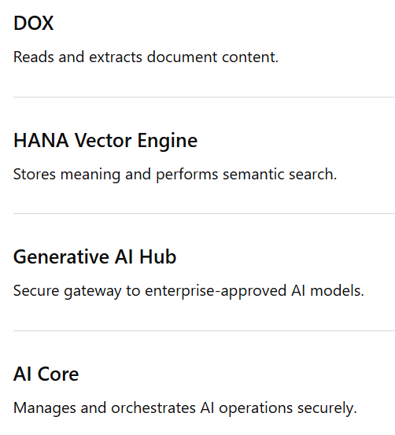
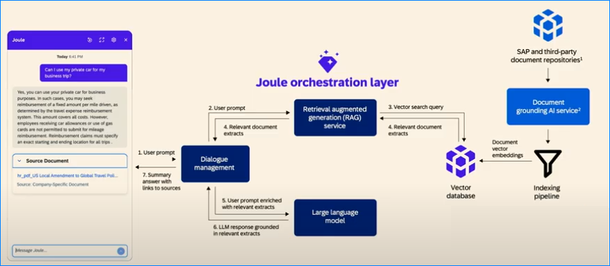

# SAP JOULE

### From Article 1

[SAP Joule – The Future of SAP’s AI, Explained Simply (Beginner-Friendly) | LinkedIn](https://www.linkedin.com/pulse/sap-joule-future-saps-ai-explained-simply-anusha-gamage-oar4c/)

SAP Joule - SAP’s AI assistant that runs on SAP BTP.

(SAP BTP is SAP cloud platform)

*SAP uses globally trusted cloud providers to deliver Joule: Amazon Web Services (AWS), Google Cloud Platform (GCP), Microsoft Azure.*

*So while customers access Joule via SAP, the underlying infrastructure uses these hyperscalers — depending on the customer’s selected BTP region. You don’t manually choose AWS/Google/Azure. SAP manages this automatically based on your BTP region.*

Helps with:

- Quick insights & summaries
- Automating routine tasks
- Providing recommendations
- Answering natural-language questions
- Supporting S/4HANA, SuccessFactors, Ariba & more

Created around 2023. 

we can ask questions in natural language

Name meaning : “AI that gives energy/productivity to business work.”, and unit of energy is Joule

Almost every team uses this Joule for their assistance

Under Joule : Generative AI, SAP Business Data, SAP BTP

Things Joule can do :

- Answer questions
- summarize information
- generate content
- recommend actions
- Automate tasks

---

### Document Grounding - One of Joule’s powerful capabilities

This allows SAP to read long documents and produce accurate answers that are grounded to actual content

Normal AI’s like ChatGPT answers based on internet data. This leads to : vague/generic answer, inaccurate results, miss company context, hallucinate (fake answers)

But a company need AI to answer based on :

- company policies
- internal documents
- SAP reports
- manuals
- HR rules
- business procedures
- contracts
- PDFs
- enterprise knowledge

So SAP introduced document grounding. Making the AI answer using specific company documents as the source of truth. 

[The uploaded documents are “Grounded Documents”]

example: employee asks joule - “ what is leave policy for interns?”

without grounding : general leave policy

with grounding : joule reads company HR policy, extracts relevant information, answers according to company rule. 

This is because an enterprise AI must be:

- accurate
- trusted
- secure
- business-specific

Kind of documents can be grounded : 

They need their business context, grounding provides it

- PDFs
- Word documents
- policies
- knowledge base articles
- SAP documentation
- process manuals
- training documents
- contracts
- compliance documents

RAG ( Retrieval-Augmented Generation ) - AI concept behind grounding

Advantage : less generic, more enterprise-aware, more trustworthy

Disadvantage : if documents becomes outdated, incorrect then AI answers also become bad

---

This document grounding is done using following SAP BTP AI components :

- SAP Document Information Extraction (DOX)
- SAP HANA Cloud Vector Engine
- Generative AI Hub
- SAP AI Core

**SAP Document Information Extraction (DOX) :** it extracts text, tables, structure, fields, layouts from documents

**SAP HANA Cloud Vector Engine :** AI searching in large documents is impossible. Consider a document containing million pages, then user asks about something and answer is given instantly. This is made possible using Vectors

Normal Keyword search may fail because : if the document says travel allowance, and user asks travel reimbursement, normal keyword search fails even though they share same meaning. This vector engine helps AI understand the meaning, not just exact words.

AI Converts text into mathematical expression like this :

“travel reimbursement”
→ [0.23, -0.91, 0.77, ...]

This numbers represent meaning, similar meaning texts produce similar vectors

HANA Vector Engine does :

- stores document meanings
- compares semantic similarities
- retrieves relevant chunks

All these are done very fast

[This is like Meaning-based smart search engine]

**SAP Generative AI Hub :** central AI Gateway

Companies may use different AI models like OpenAI models, Anthropic, Google, Meta. if a developer  connects to random AI Models, it leads to data leakage and security problems. SAP cant allow this. so SAP created : SAP Generative AI Hub

“A central place inside SAP where companies securely access and manage AI models.”

Suppose Joule receives: “Summarize this HR policy.”

Now Joule needs an AI model to generate language.

It may use:

- GPT model
- Claude model
- SAP model

But instead of directly calling model:

Joule → Generative AI Hub → AI Model

The Hub sits in middle for security, governance, flexibility, enterprise integration.

When a user asks a question, the AI Hub sends this question and relevant document context to the LLM. Then the model generates answer.

Example : 

User asks: “Summarize contractor access policy.”

AI Hub sends:

- relevant policy paragraphs
- user question

to LLM.

LLM generates grounded answer.

**SAP AI Core:** AI operations manager

Orchestration means managing :

- which AI runs
- when it runs
- security
- scaling
- monitoring
- workflows

It securely manages:

- AI workflows
- model execution
- enterprise deployment
- permissions
- scaling
- APIs

AI Core is Control center of enterprise AI

---

To use Joule, organizations need:

- An **SAP BTP Global Account**
- Entitlements for **Joule / SAP AI Units**
- A BTP region where **Joule is supported**
- Connected SAP applications (e.g., S/4HANA Cloud, SuccessFactors)

**Using Joule:**

1. Enable the *Joule* service in SAP BTP
2. Assign AI Units
3. Activate Joule for each SAP App
4. Configure Identity & Authorization
5. Start using Joule through SAP Start or inside your SAP solution

No servers. No patching. No manual installations.

(**SAP Start is a central entry point for accessing SAP cloud business solutions, providing role-based content, tasks, and insights in a unified interface.)**

AI Unit is SAP’s measurement system for how much enterprise AI processing a company can use.

AI Unit is the consumption/license/usage measurement. 

When company enables:

- Joule
- AI Core
- AI services

SAP allocates AI capacity through AI Units.

Companies purchase/assign them.

These are assigned because companies want control. 

Example:

- HR department → limited AI usage
- Finance AI → high priority
- Testing systems → small quota

AI Units help allocate resources.

Internally, AI Units help manage:

- token usage
- compute usage
- inference cost
- AI workload consumption

But SAP abstracts this complexity.

So companies simply see: **AI Units consumed** instead of raw GPU metrics.

### From Article 2

[SAP Joule for Beginners: Everything You Need to Kn... - SAP Community](https://community.sap.com/t5/technology-blog-posts-by-members/sap-joule-for-beginners-everything-you-need-to-know-all-at-one-stop/ba-p/14160885)

**Some Important terms:**

- **Gen AI :** also known as generative AI is a model where it can create new content which can either be text, image, audio and video based on the existing content that it already has.
- **LLM (Large Language Model) :** is the specific model (like GPT, PaLM, LLaMA) that powers the text generation part of GenAI. It is a type of artificial intelligence model that is trained to understand and generate human-like language. It's designed to read, summarize, translate, predict, or generate text based on the input it receives.
- **AI copilot :**  is a virtual assistant that helps business application users complete tasks more easily through a conversational interface. It uses generative AI to understand requests, take actions, and offer insights from business data. AI Copilots use LLMs to understand natural language and assist users in real time.
- **Retrieval-Augmented Generation (RAG):** In SAP world, customer specific data cannot be used to train the LLMs. And hence we need a better way to retrieve the desired outcomes without breaching the customer's data privacy. This is where RAG comes into picture. It is used to generate more relevant answers to an SAP user's question without actually training the Large Language Model (LLM). This is done through Document Grounding. As a part of preparation of RAG, it provided with SAP and customer specific documents such as HR policies, manuals, and SOPs that may be useful for answering SAP user queries. These documents are then chunked into smaller parts and are then embedded into dense, continuous vectors—known as embeddings—which represent the data in a high-dimensional space. These embeddings are then stored in the HANA Vector Database for retrieval based on the user's query. This information is passed to the LLM as prompts during runtime rather than getting it trained. The LLM uses this prompt to generate a response in real time. Thus, LLMs are not trained against customer data. Rather, they get Grounded against customer specific data.
- **HANA Vector Database :** enables the storage, indexing, and searching of unstructured data like vector embeddings (numerical representations of text, documents, or images). For example, company policy documents are broken into chunks and converted into multi-dimensional vectors  using an AI model. These vectors, along with metadata, are stored in the SAP HANA Vector Database to enable semantic search, so RAG can retrieve relevant content for the LLM to generate accurate natural language responses.

**SAP Joule** is an AI copilot from SAP. Powered by SAP BTP (Business Technology Platform), it serves as a virtual assistant that leverages generative AI to understand and respond to user requests within SAP systems.

Joule is seamlessly integrated into various SAP cloud solutions to help users work more efficiently across different business functions, such as:

- SAP S/4HANA Cloud
- SAP S/4HANA Cloud, private edition
- SAP SuccessFactors
- SAP Ariba
- SAP Sales Cloud
- SAP Customer Experience solutions
- SAP Concur
- SAP ABAP Cloud

> **However, it is worth noting that Joule is not available for on-premise solutions.**
> 

**Main Advantages of SAP Joule :**

- Enhanced decision-making
- Accelerated end-to-end business processes
- Personalized UI with inherited user authorizations
- Advanced analytics
- Contextual awareness
- Ability to meet diverse business needs

Interaction with Joule can vary :

- **Informational** → “Just give me information” : You ask a question, and Joule answers with facts or policies.
- **Navigational** → “Show me where/how” : You know what you want to do, but not where to do it in the SAP app.
- **Transactional** → “Do the task for me” : Joule actually performs actions and updates data.
- **Analytical** → “Analyze data and explain insights” : Joule studies company data and shows trends, charts, or insights.

---

**Joule Architecture :** 

It consists of some key components that work together to respond to user’s question.

1. **Scenario Catalog :** The Scenario Catalog holds information about all the available scenarios, functions, and skills in SAP cloud applications. In helps to distinguish between different user questions and guides Joule to understand the request and connect it to the right action or system or workflow. This acts like a blueprint that maps user queries to the appropriate actions, destinations, or logic within SAP systems.
2. **Knowledge Catalog :** It is a collection of documents and content sources (often unstructured or semi-structured) that are made available to Joule for question-answering using RAG (Retrieval-Augmented Generation) techniques.
3. **User Context :** Joule checks who the user is, their roles/permissions, previous chat history.  A user will be able to view or perform any tasks only if they are authorized to do so based on their existing authorization.
4. **Document Grounding :** Large Language Models (LLMs) are generally capable of understanding prompts and generating human-like responses. However, they often lack the context and specificity needed for business scenarios. To address this, Joule uses a technique called *document grounding*.
5. **Grounding :** This is the process of combining generative LLMs with advanced information retrieval techniques to enhance the accuracy and relevance of responses—without the need to train or fine-tune the model on company-specific data.
6. **RAG (Retrieval-Augmented Generation) :** RAG is used to generate more relevant answers to an SAP user's question without actually training the Large Language Model (LLM). As part of the RAG, Document Grounding is performed. In this step, RAG is provided with relevant documents such as HR policies, manuals, and SOPs that may be useful for answering SAP user queries. 
7. **HANA Vector Database :**  It enables the storage, indexing, and searching of unstructured data like vector embeddings (numerical representations of text, documents, or images). This allows AI systems to retrieve and interpret information based on semantic meaning, not just keywords.
        
8. **Knowledge Graph :** This graph is a semantic network that connects entities (like customers, products, orders, employees, etc.) and defines how they are related. This helps Joule go beyond keyword matching. ****It actually lets Joule "understand" business context and structure.  Joule uses the graph to understand how different entities are linked.

---

*When SAP’s AI assistant Joule interacts with a Large Language Model (LLM), it doesn’t send data for storage or training. Instead, it shares information only briefly, as part of a prompt during runtime. The LLM uses this prompt to generate a response in real time, but it doesn’t remember or learn from what it receives. Thus, LLMs are not trained against customer data.*

---

**Joule’s Orchestration Layer :**

**What Orchestration Layer Does?** 

Understand the user request, chooses the right components, coordinates multiple systems, manages workflow sequence, handles AI and business logic together.

**Steps in Joule processing user request :** 

1. User submits query in natural language via Joule client in SAP cloud apps
2. The prompt is sent to the Dialogue Management system, which manages the conversation flow and understands the user's intent.
3. The Retrieval-Augmented Generation (RAG) service forms a semantic vector search query based on the user input.
4. This query is executed against a Vector Database where document embeddings are stored. The relevant document extracts are retrieved. These embeddings were created earlier from company-specific or SAP documents using document grounding
5. The retrieved document snippets are passed along with the original prompt to a Large Language Model. The LLM uses the relevant extracts to ground its response (ensuring the response is based on actual documents, not hallucinations).
6. The LLM generates a natural-language answer, grounded in the retrieved documents.
7. The final answer is displayed to the user with source links and supporting documents attached.->Example: A link to a company travel policy PDF is shown under “Source Document”.

---

*Note: Read Article for further understanding on how the workflow is for different user prompts, to know about Joule packages & pricings, and to know about how joule is used by different peoples like consultants, developers. Also some reference links is also mentioned in article at last, use those for deeper learning about Joule.*

[Introducing Joule](https://learning.sap.com/courses/introducing-joule) - this is free course in [learning.sap.com](http://learning.sap.com) 

---